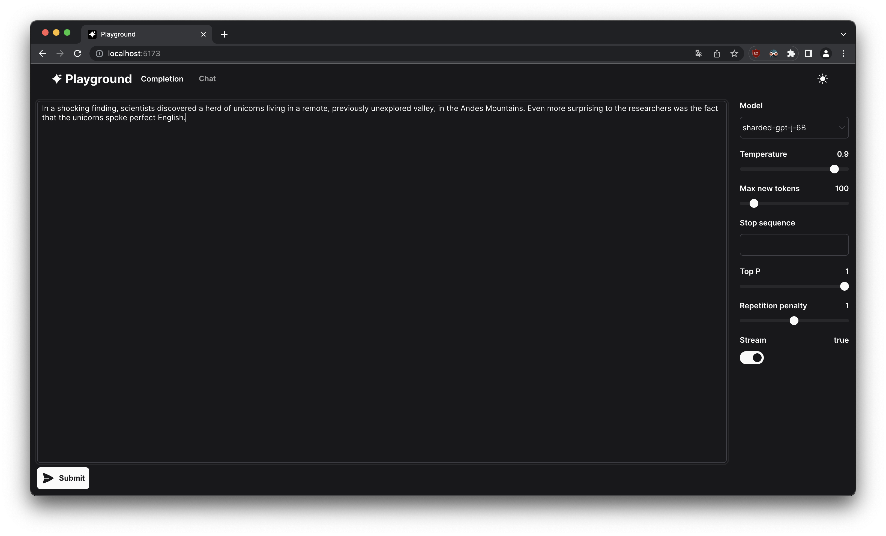

# Playground


An interface to interact with Large Language Models

## Roadmap

> **Warning**
>
> This project is heavily experimental and is subject to changes.

- [ ] Seperate primitives into a separate library
- [ ] Chat mode

## Usage

- Clone this repository

```bash
git clone https://github.com/qtrrb/playground
```

- Write .env with the endpoint of your [transformers-api](https://github.com/qtrrb/transformers-api) server

- Run playground with

```bash
npm run dev
```

or

```bash
npm run build
serve dist
```
